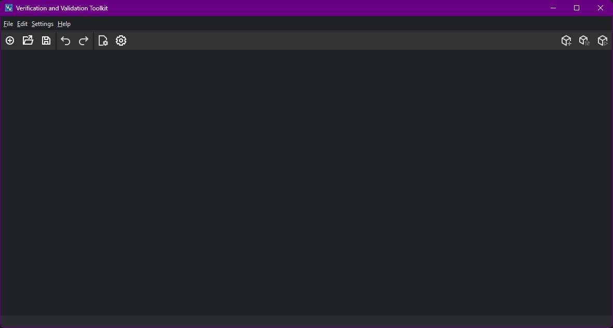
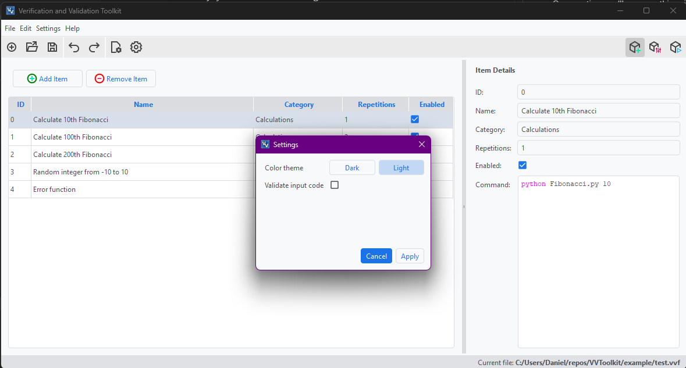
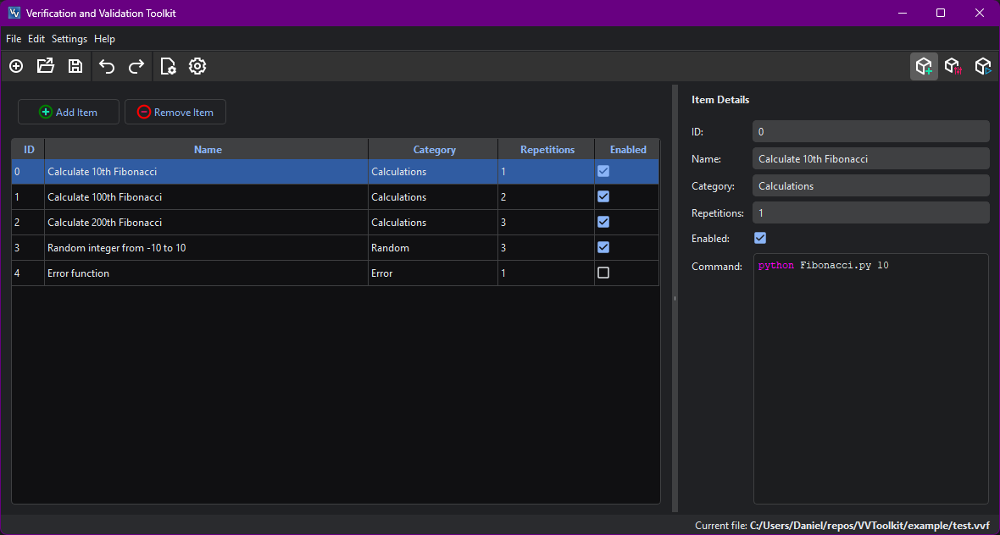
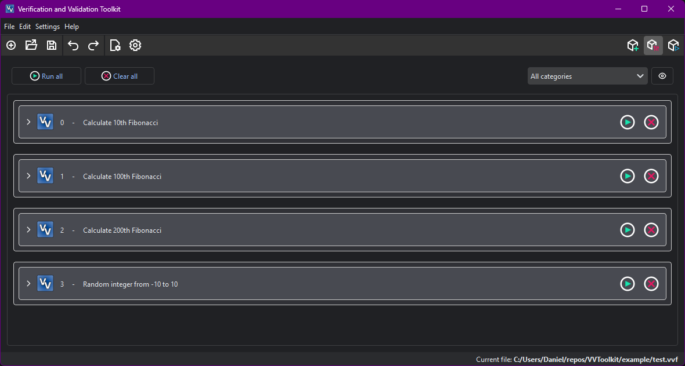
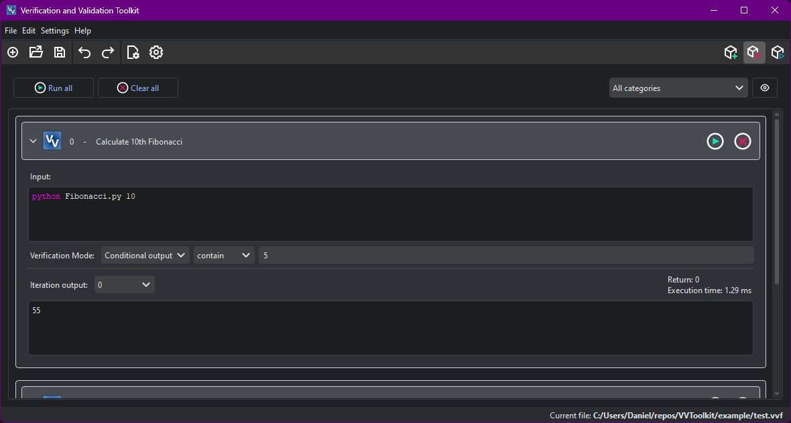
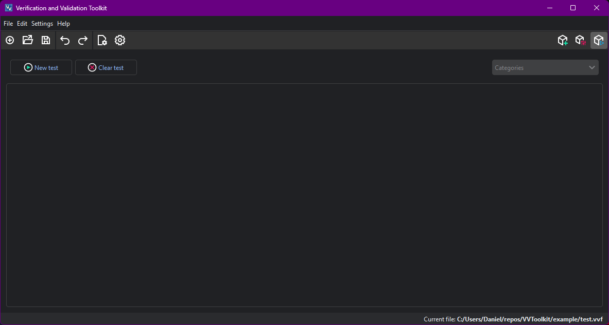
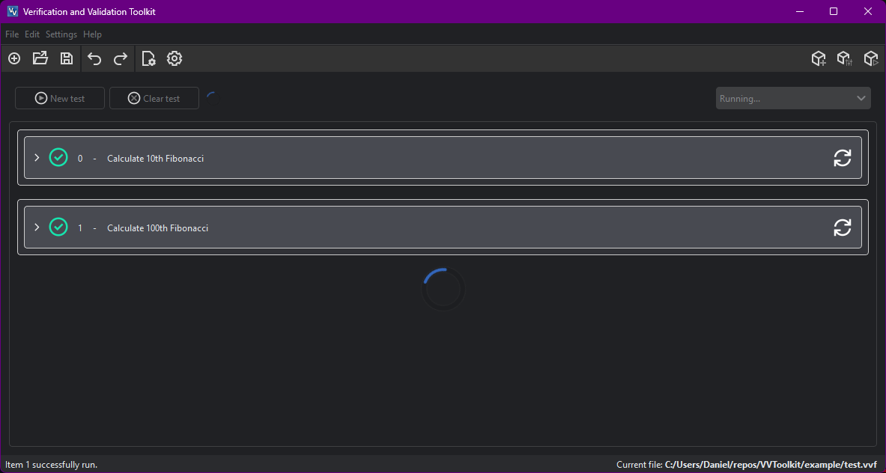
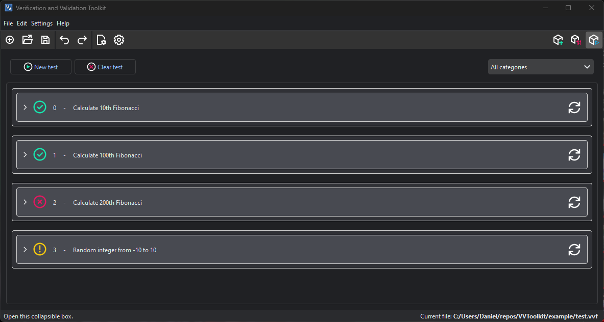
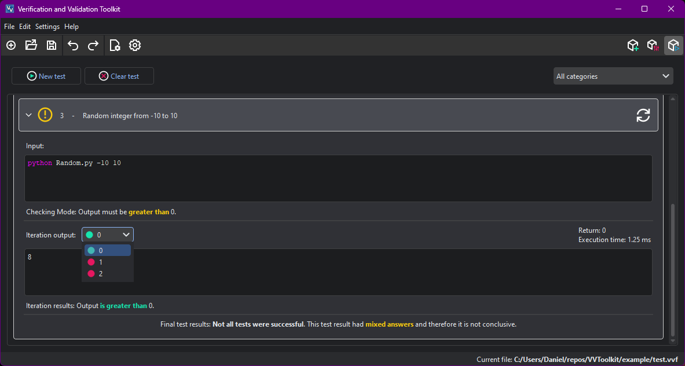

# How to use the VVT (Validation and Verification Toolkit) program

##  First steps

On execution, you'll see something similar to this.

From here, you can do several things:

- Start a **new** file on File > New (`Ctrl + N`). 
- **Open** a saved file from your computer on File > Open (`Ctrl + O`). The saved files have extension `.vvf`.
- **Import** a test result by clicking File > Import test results. The test results have extension `.vvt`.

If you created a new file or opened an already existing one, you'll be greeted to the [SETUP mode](#setup-mode) window.

If you chose to import a test result, you'll enter [TEST mode](#importing-test-results).

You can also change the **color theme** of the app by clicking Settings > Program settings (`Ctrl + R`) and selecting `Light` mode. 

##  SETUP Mode 

On **SETUP** mode you can create a list of all the individual tests that will conform your project.

If you chose to open this [example](test.vvf) file, you would see the following: 

On the left table, you'll see the list of tests to run for your project. By clicking on any of the cells, the *Item Details* pane will pop up on the right. You may modify all tests on either the table or the details pane.

Each test has the following fields on this mode:

- `ID`. This is will be the order of execution on [TEST mode](#test-mode). It's always a positive number and each test has a different one.
- `Name`. A brief description of what this test does or what it will accomplish.
- `Category`. For an easier arrangement of the tests on the other modes, you may group your tests in categories.
- `Repetitions`. The number of times this test will be run. This will also be the number of outputs the test will generate.
- `Enabled`. This specifies if the test will be run on [TEST mode](#test-mode) or not.
- `Command`. This is the code or command to run on a shell to launch this test. Bear in mind the `cwd` of all commands **will be the directory of the file you opened**.

On this mode you can choose to either add new items by pressing the button `Add items` (`Alt + N`), remove them by first clicking on them and pressing `Remove item` (`Del`) or duplicate items by selecting and then pressing `Alt + D`.

Once done, the next logic step would be to enter [BUILD mode](#build-mode) by clicking its icon on the top right corner.

You may save your progress anytime by clicking File > Save or `Ctrl + S`.

##  BUILD Mode

On **BUILD** mode you specify which conditions are to be met for each test to be satisfactory.

Each test defined on [SETUP mode](#setup-mode), will be shown here on its own *box*. If you open a lot of test, it can get quite cumbersome to traverse the list. That's why you can filter the tests by choosing its category on the combo box on the top right. You may also show or hide disabled tests with the eye button on the right.

If you click on any of the boxes, you'll see something similar to this:

Each box has the following fields:
- `Input`. It's the same as in [SETUP mode](#setup-mode).
- `Verification Mode`. At the time, you may choose the following:
  - `Same output`. The output(s) on TEST mode must be the same as in BUILD mode.
  - `Conditional output`. You may choose what type of **operation** and **operand** to apply on the output to consider it valid. 
  
    The following operations are available: `==`, `<>`, `<`, `>`, `<=`, `>=`, `contain` and `not contain`. 
    
    The program will try to first operate numerically if both the output and operand are numbers. If not, the operations will be carried out as strings.
- `Iteration output`. You may get the output of the functions by either running all tests (pressing the `Run all` button) or by running each test individually (the green play button on the top right corner of the box). This output is mainly needed for the `Same output` verification mode, but on next versions it will be needed for new incoming modes.

    Each output also stores its `execution time` and `return code`.

All **enabled tests must be run** on [BUILD mode](#build-mode) before passing to [TEST mode](#test-mode). 

If an error were to occur, you'll get a warning window with the error code. Try to get one yourself by enabling the test "4 - Error function".

##  TEST Mode

On **TEST** mode you will run all tests on sequence and without interruption. This will generate a report you'll be able to export to a save file (`.vvt`) or to an Excel file (`.xlsl`). The last one can be printed or exported to PDF format.

This mode is done so that **all tests have to pass first try**; in other words, there must not be any exception or fatal error, that would invalidate the tests results. If a single test were to fail, you can retry it individually, but would affect the final result.

Press the `New test` button to start a test. 

If you want to start another test, first [export it](#exporting-test-results) and then press `Clear test` or press `New test` again (a pop-up will appear).

Each box will have a symbol indicating the result of the test. An extensive explanation can be found by opening the box. You can also check the result of each iteration by selecting its number of the `Iteration output` combo. The little colored dot on the left of the number indicates the result of the iteration.

##  Importing test results

This mode is read-only. It's only used to visualize on the program a previous test result. It still allows you to export it again, as either a `.vvt` or `.xlsx` file.

##  Exporting test results

Once your test has been run, **export the report** (saving won't work!) by pressing File >  Export test results.

Before that you can set some extra fields for the report by clicking on Edit > Project settings (`Alt + .`). This fields are:

- `Name`. Name for the report.
- `Project` name.
- `Author` of the VVT project.
- `Conductor` of the test.
